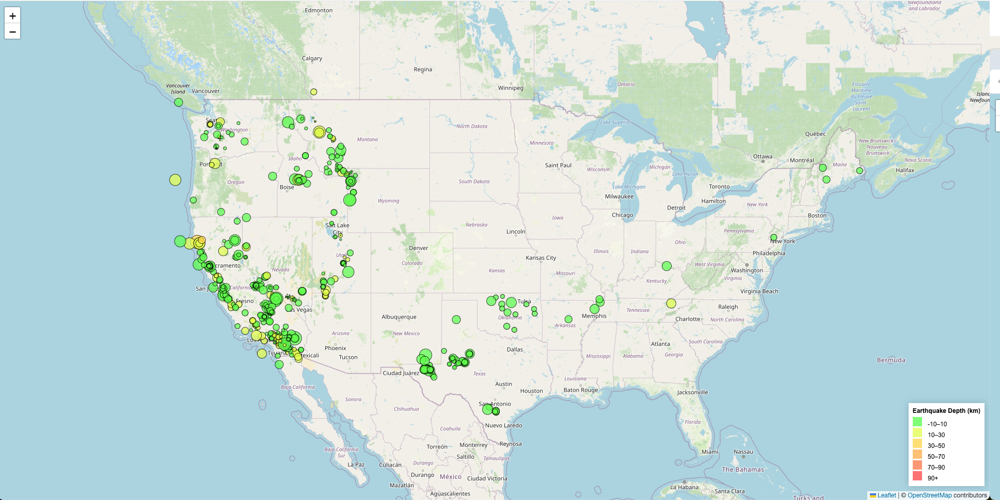

# Module-15-Challenge

## Create the Earthquake Visualization

- I chose the **All Earthquakes from the Past 7 Days** format to visualize an earthquake dataset.

- To set the initial view to center on the USA, I consulted ChatGPT for the corresponding latitude and longitude and used the coordinates [39.8283, -98.5795].

## Result

## Resources

Resources that I referred to for completing this homework:

<https://chatgpt.com/>
